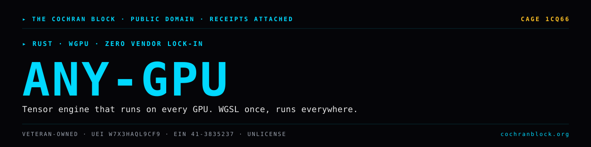

<!-- COCHRANBLOCK-BRAND-HEADER:START - generated by cochranblock/scripts/brand-stamp.sh -->
<picture>
  <source media="(prefers-color-scheme: dark)" srcset="assets/brand/banner.svg">
  <source media="(prefers-color-scheme: light)" srcset="assets/brand/banner.svg">
  
</picture>

[](https://unlicense.org)
[](https://www.rust-lang.org)
[](https://cochranblock.org)
[](https://cochranblock.org)

> &#9656; **RUST** &#183; **WGPU** &#183; **ZERO VENDOR LOCK-IN**
<!-- COCHRANBLOCK-BRAND-HEADER:END -->


# any-gpu

**Tensor engine that runs on every GPU. AMD, NVIDIA, Intel, Apple. One codebase, one shader language, zero vendor lock-in.**

wgpu picks the backend — Vulkan on Linux, Metal on macOS, DX12 on Windows. You write WGSL compute shaders once. They run everywhere.

---

## Documentation

**[cochranblock.github.io/any-gpu](https://cochranblock.github.io/any-gpu/)** — full mdBook docs (architecture, ops, benchmarks, inference, hardware matrix, provenance).

Source-of-truth files at the repo root:

- **[PROOF_OF_ARTIFACTS.md](PROOF_OF_ARTIFACTS.md)** — what exists today, status, source-linked. Architecture, op catalog, build output, hardware verification across 4 GPUs, full benchmark matrices (any-gpu vs CUDA vs MPS), NanoSign signing, Triple Lens evaluation, roadmap. If you want to know what this project *does*, read this.
- **[TIMELINE_OF_INVENTION.md](TIMELINE_OF_INVENTION.md)** — dated, commit-level record of what was built, when, and why. If you want to know how this project *got built*, read this.

Supporting docs:
- [BACKLOG.md](BACKLOG.md) — prioritized open work
- [docs/compression_map.md](docs/compression_map.md) — P13 tokenization (fN/tN)

---

## Run It

```bash
cargo add any-gpu                              # Add to your project
cargo run --release --example bench            # Benchmark all sizes
cargo test --release                           # 309 tests
WGPU_BACKEND=vulkan cargo test --release       # Force Vulkan on AMD
```

Full hardware matrix, benchmarks, and reproduce commands in [PROOF_OF_ARTIFACTS.md](PROOF_OF_ARTIFACTS.md).

---

## Inference Stack (Sprint 7)

any-gpu can run LLaMA-compatible models from safetensors weights:

```bash
cargo run --release --bin any-gpu-serve -- \
  --model /path/to/model.safetensors \
  --config /path/to/config.json \
  --tokenizer /path/to/tokenizer.json
```

- `t544 = Tokenizer` — HuggingFace tokenizers wrapper
- `t548 = CausalLM` — LLaMA-compatible forward (embedding → attention → MLP → LM head)
- `f626` — fused online-softmax SDPA (no N×N allocation — fits long contexts in 8 GB VRAM)
- `f629` — repeat_kv for GQA (Grouped Query Attention)
- `t539 = LayerPager` — streams model weights from RAM to VRAM one layer at a time
- `POST /generate`, `GET /health`

Supports LLaMA 2, LLaMA 3, Mistral, Qwen2 weight format. Safetensors only — no GGUF, no PyTorch .bin.

---

## License

[Unlicense](UNLICENSE) (public domain).

Part of [The Cochran Block](https://cochranblock.org) — see also [kova](https://github.com/cochranblock/kova), [pixel-forge](https://github.com/cochranblock/pixel-forge), [tmuxisfree](https://github.com/cochranblock/tmuxisfree)
<!-- COCHRANBLOCK-BRAND-FOOTER:START - generated by cochranblock/scripts/brand-stamp.sh -->

---

<sub>&#9656; **THE COCHRAN BLOCK, LLC** &#183; Veteran-Owned &#183; **CAGE** `1CQ66` &#183; **UEI** `W7X3HAQL9CF9` &#183; **EIN** `41-3835237`</sub>

<sub>&#9656; PUBLIC DOMAIN &#183; UNLICENSE &#183; RECEIPTS ATTACHED &#183; [**cochranblock.org**](https://cochranblock.org) &#183; [github.com/cochranblock](https://github.com/cochranblock)</sub>
<!-- COCHRANBLOCK-BRAND-FOOTER:END -->
